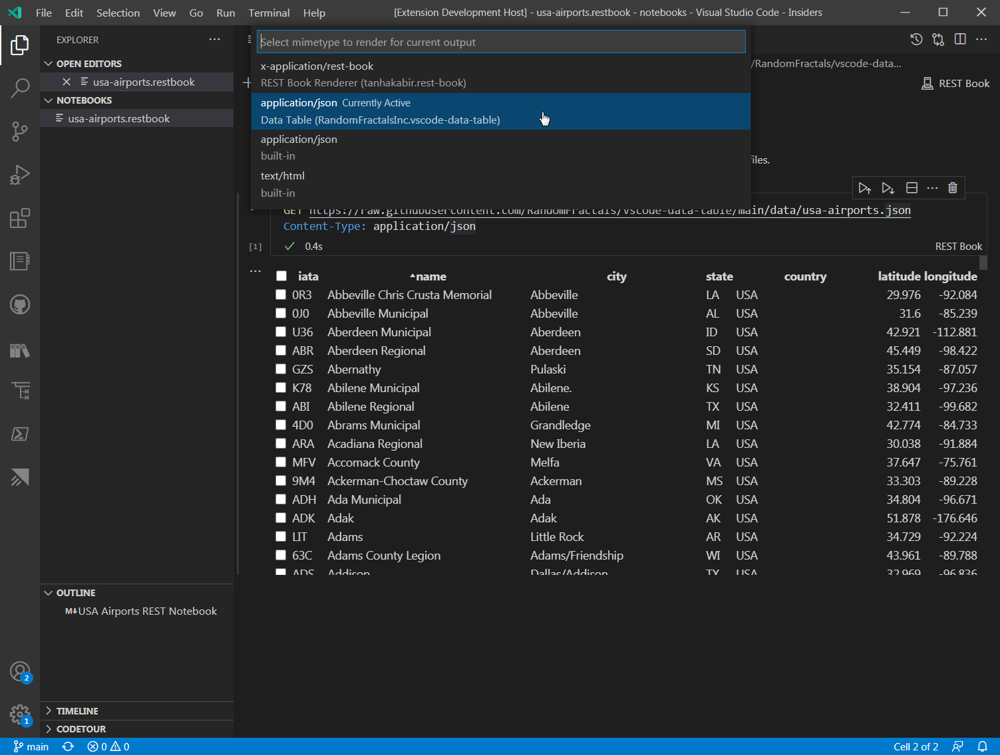

# vscode-data-table

<h1 align="center">
  
  <br />
  Data Table for Notebook 📓 cell ⌗ data outputs
</h1>

See [Data Preview](https://github.com/RandomFractals/vscode-data-preview) 🈸 vscode extension for a generic [Grid Data Viewer](https://marketplace.visualstudio.com/items?itemName=RandomFractalsInc.vscode-data-preview) with many common data formats support, search, sort, filters, grouping, splits, pivot tables, aggregates, and basic charts 📊

## Data Table View

<p align="center">
  
</p>

# Dev Log

See [#DataTableView 🈸 tag on Twitter](https://twitter.com/hashtag/dataTableView?src=hash&f=live&vertical=default) for the latest and greatest updates on this vscode extension and what's in store next.

# Dev Build

```bash
$ git clone https://github.com/RandomFractals/vscode-data-table
$ cd vscode-data-table
$ npm install
$ npm run compile
$ code .
```
`F5` to launch Data Table extension VSCode debug session.

||

```bash
vscode-data-table>vsce package
```
to generate `VSIX` Data Table extension package with [vsce](https://code.visualstudio.com/api/working-with-extensions/publishing-extension#vsce) from our latest for local dev install in VSCode.
